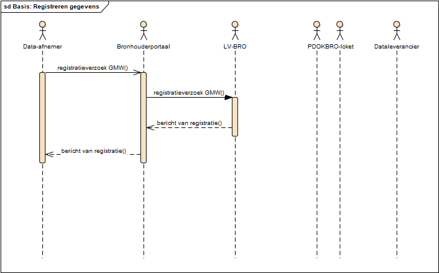

# Scenario's

In dit hoofdstuk worden de interactiepatronen van verschillende scenario's beschreven in het BRO berichtenverkeer voor de volgende use cases:

1. Registreren van gegevens: een dataleverancier wil gegevens registreren in de LV-BRO.  
2. Corrigeren van gegevens: een dataleverancier wil gegevens corrigeren in de LV-BRO.  
3. Afnemen van gegevens: een data-afnemer wil gegevens afnemen van de LV-BRO.  

De use cases zijn afgebeeld in het use case model; de interactiepatronen voor de verschillende scenario's worden in sequentiediagrammen afgebeeld.

## Registreren van gegevens

### Basis: registratieverzoek succesvol verwerkt

De verwerking van een registratieverzoek verloopt geheel automatisch en volgens een vaste opeenvolging van stappen. Dit is waar het in het kort op neerkomt:

1. De dataleverancier stuurt vanuit zijn systeem een _registratieverzoek_ met daarin een brondocument. Het systeem van de BRO voert een toegangscontrole uit.
2. Wanneer toegang tot het systeem van de BRO is verkregen, begint de controle van het verzoek en wordt onder meer vastgesteld of het verzoek inhoudelijk aan de gestelde eisen voldoet.
3. Wanneer de inhoudelijke controle geen fouten oplevert en er geen technische problemen zijn, wordt het registratieverzoek door het systeem van de BRO geaccepteerd. De aangeboden gegevens worden met de gegevens die de BRO zelf genereert vastgelegd. Het BRO-systeem stuurt het systeem van de dataleverancier als antwoord het _bericht van registratie_ dat diens registratieverzoek is verwerkt.

Het resultaat van de verwerking is dat het brondocument in het register brondocumenten ondergrond is opgenomen, dat de gegevens eruit zijn gehaald en vastgelegd zijn in de registratie ondergrond. De gegevens zijn dan voor eenieder beschikbaar.

De stappen en de bijbehorende berichten voor het registeren van gegevens worden in het onderstaande sequentiediagram getoond.

### Fout: registratieverzoek afgewezen

In de verwerking van het registratieverzoek zijn allerlei controles ingebouwd en kan er toe leiden dat een registratieverzoek wordt afgewezen. Dit is waar het in het kort op neerkomt:

1. De dataleverancier stuurt vanuit zijn systeem een _registratieverzoek_ met daarin een brondocument. Het systeem van de BRO voert een toegangscontrole uit.
2. Wanneer toegang tot het systeem van de BRO is verkregen, begint de controle van het verzoek en wordt onder meer vastgesteld of het verzoek inhoudelijk aan de gestelde eisen voldoet.
3. Wanneer de inhoudelijke controle fouten oplevert, wordt het verzoek afgewezen en ontvangt het systeem van de dataleverancier een _bericht van afwijzing_.

Het resultaat van de verwerking is dat het brondocument niet in het register van brondocumenten ondergrond is opgenomen. De gegevens zijn niet voor eenieder beschikbaar.

De stappen en de bijbehorende berichten voor het registeren van gegevens worden in het onderstaande sequentiediagram getoond.

## Corrigeren van gegevens

### Basis: verzoek tot correctie succesvol verwerkt

### Fout: verzoek tot correctie afgekeurd

## Afnemen van gegevens

### ...
