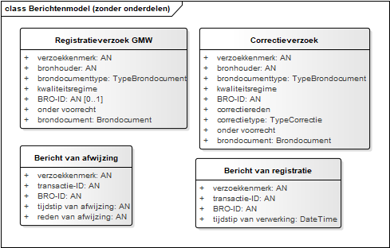

# Berichten

Onderstaand figuur toont de berichten in het BRO berichtenverkeer.

## Registratieverzoek

[Tabel: Beschrijving van het registratieverzoek]

| Naam       | Registratieverzoek GMW    |
|------      | --------------------------|
| Alias             | registrationRequest  |
| Definitie         | Een bericht dat een dataleverancier stuurt om gegevens van een object te laten registreren. |
| Datum opname      |  |
| Unieke aanduiding | verzoekkenmerk |
| Toelichting| ...  |

[Tabel: Overzicht attributen]

| Attribuut | Kardinaliteit | Beschrijving |
| ----------| --------------| -------------|
| verzoekkenmerk | 1-1 | Zie [paragraaf ](#711-identificatie) |
| bronhouder | 1-1 | Zie [paragraaf ](#711-identificatie) |
| brondocumenttype | 1-1 | Zie [paragraaf ](#711-identificatie) |
| kwaliteitsregime | 1-1 | Zie [paragraaf ](#711-identificatie) |
| BRO-ID | 0..1 | Zie [paragraaf ](#711-identificatie) |
| onder voorrecht | 1-1 | Zie [paragraaf ](#711-identificatie) |
| brondocument | 1-1 | Zie [paragraaf ](#711-identificatie) |

## Bericht van registratie
[Tabel: Beschrijving van het bericht van registratie]

| Naam       |     |
|------      | --------------------------|
| Alias             | intakeResponse  |
| Definitie         |  Het bericht dat de dataleverancier als antwoord krijgt, wanneer de verwerking van het verzoek foutloos is verlopen.                        |
| Datum opname      |  |
| Unieke aanduiding | verzoekkenmerk |
| Toelichting| ...  |

[Tabel: Overzicht attributen]

| Attribuut | Kardinaliteit | Beschrijving |
| ----------| --------------| -------------|
| verzoekkenmerk | 1-1 | Zie [paragraaf ](#711-identificatie) |
| transactie-ID | 1-1 | Zie [paragraaf ](#711-identificatie) |
| BRO-ID | 1-1 | Zie [paragraaf ](#711-identificatie) |
| tijdstip van verwerking | 1-1 | Zie [paragraaf ](#711-identificatie) |

## Bericht van afwijzing
[Tabel: Beschrijving van het bericht van registratie]

| Naam       |     |
|------      | --------------------------|
| Alias             | intakeResponse  |
| Definitie         |  Het bericht van afwijzing dat de dataleverancier als antwoord krijgt wanneer bij de verwerking een invoerfout in het verzoek wordt gevonden verschilt maar op een punt van dat wat teruggegeven wordt bij het begin van de registratie. 
                        |
| Datum opname      |  |
| Unieke aanduiding | verzoekkenmerk |
| Toelichting| ...  |

[Tabel: Overzicht attributen]
| Attribuut | Kardinaliteit | Beschrijving |
| ----------| --------------| -------------|
| verzoekkenmerk | 1-1 | Zie [paragraaf ](#711-identificatie) |
| transactie-ID | 1-1 | Zie [paragraaf ](#711-identificatie) |
| BRO-ID | 1-1 | Zie [paragraaf ](#711-identificatie) |
| tijdstip van afwijzing | 1-1 | Zie [paragraaf ](#711-identificatie) |
| reden van afwijzing | 1-1 | Zie [paragraaf ](#711-identificatie) |

